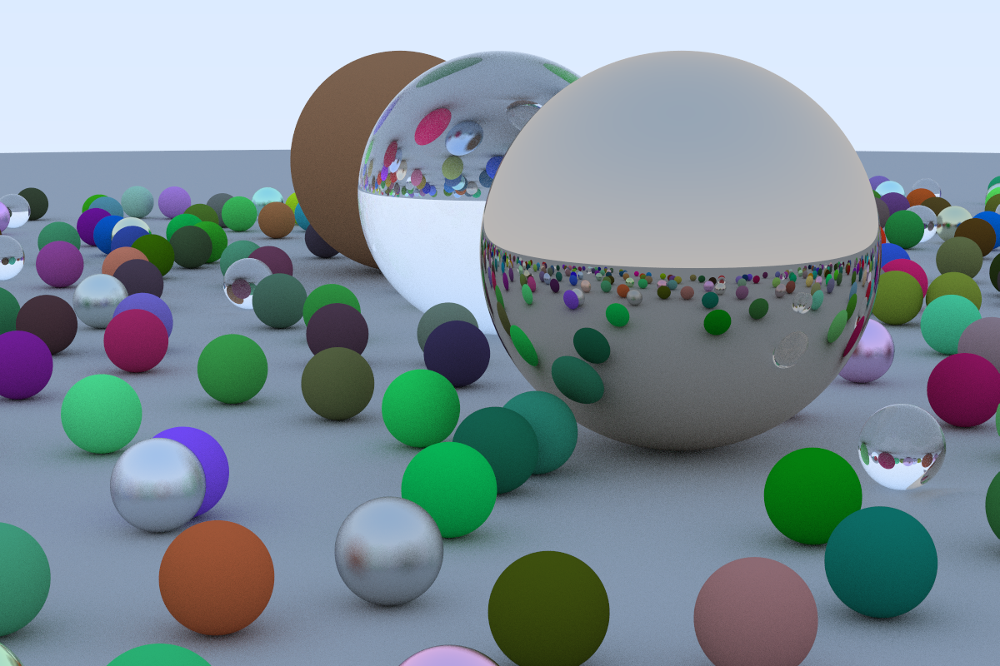
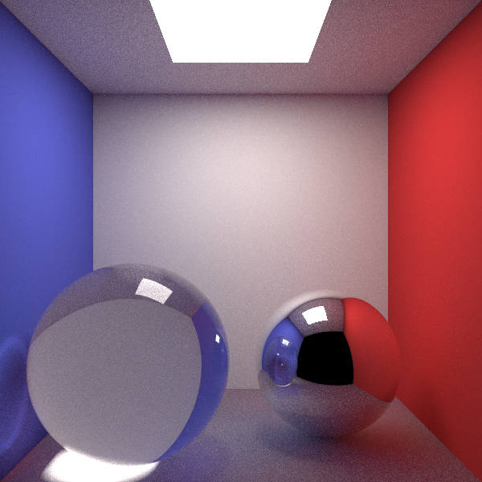

# ntraycer

A physically-based Monte Carlo path tracer written in pure D with zero external dependencies. This project implements a complete ray tracing pipeline from scratch, including all mathematical primitives, file I/O via Linux syscalls, and advanced rendering techniques.





## Features

- **Zero External Dependencies**: Every component is implemented from first principles
  - Custom math library (vectors, rays, trigonometry, RNG)
  - Direct Linux syscall interface for file I/O
  - Custom mutable string implementation for PPM image output
- **Monte Carlo Path Tracing** with unbiased global illumination
  - Next Event Estimation (NEE) for efficient direct lighting
  - Multiple Importance Sampling (MIS) combining BSDF and light sampling
- **BVH Acceleration** for fast ray-scene intersection
- **Physically-based Materials**: Lambertian, Metal, Dielectric, Emissive

## Architecture

### Project Structure

```
ntraycer/
├── dub.sdl                      # D build configuration
├── build/
│   ├── build.sh                 # Release build script
│   ├── run.sh                   # Build and execute
│   ├── test.sh                  # Run unit tests
│   └── clean.sh                 # Clean build artifacts
├── demos/
│   ├── cornell_box.png          # Cornell Box scene
│   └── spheres.png              # Ray Tracing in One Weekend scene
└── source/
    ├── app.d                    # Main entry point & scene setup
    └── lib/
        ├── core/
        │   ├── math.d           # Vec2, Vec3, Ray, RNG, math functions
        │   ├── file.d           # Linux syscall wrappers (open/write/close)
        │   └── mutstring.d      # Mutable string buffer
        ├── accel/
        │   ├── aabb.d           # Axis-Aligned Bounding Box
        │   └── bvh.d            # Bounding Volume Hierarchy
        ├── renderer/
        │   ├── renderer.d       # Path tracing renderer with NEE/MIS
        │   └── film.d           # Image buffer and output
        └── scene/
            ├── scene.d          # Scene container with optional BVH
            ├── background.d     # Environment backgrounds
            ├── light.d          # Light sampling interface
            ├── camera/
            │   ├── camera.d     # Camera interface
            │   └── pinhole.d    # Perspective pinhole camera
            ├── hittable/
            │   ├── hittable.d   # Ray intersection interface
            │   ├── sphere.d     # Sphere primitive
            │   └── mesh.d       # Triangle and Quad primitives
            └── material/
                ├── material.d   # Material interface with BSDF
                ├── lambertian.d # Diffuse material
                ├── metal.d      # Reflective material
                ├── dielectric.d # Refractive material
                └── emissive.d   # Light source material
```

This project deliberately avoids all external dependencies, including D's standard library (`std`). Everything is implemented from scratch as a learning exercise.

## Rendering Techniques

### Monte Carlo Path Tracing

The renderer uses unbiased Monte Carlo integration to solve the rendering equation. For each pixel, multiple random samples are traced through the scene, bouncing off surfaces according to their material properties. The results are averaged to produce the final color.

```d
// Core path tracing loop (simplified)
for (int bounce = 0; bounce < depth; bounce++)
{
    if (!scene.hit(currentRay, hitInfo))
    {
        radiance += throughput * background;
        break;
    }
    
    // Sample BSDF for next direction
    material.scatter(ray, hitInfo, rng, scatterResult);
    throughput *= scatterResult.weight;
    currentRay = scatterResult.scattered;
}
```

Russian Roulette termination is applied after 5 bounces to prevent infinite paths while maintaining an unbiased estimator.

### Next Event Estimation (NEE)

Instead of waiting for paths to randomly hit light sources, NEE explicitly samples lights at each diffuse bounce to reduce noise when the only light sources are small area lights (like in the Cornell Box):

1. Randomly select a light source from the scene
2. Sample a point on that light's surface
3. Cast a shadow ray to check visibility
4. Add the direct lighting contribution if unoccluded

This dramatically reduces variance for scenes with small light sources.

```d
if (scene.hasLights() && !mat.isSpecular())
{
    LightSample lightSample;
    scene.sampleLight(hitPoint, rng, lightSample);
    
    // Shadow ray test
    if (!inShadow)
    {
        Vec3 directLight = lightSample.emission * brdf * cosTheta / pdf;
        radiance += throughput * directLight;
    }
}
```

### Multiple Importance Sampling (MIS)

MIS combines BSDF sampling and light sampling using the power heuristic to minimize variance. When a path could have been generated by either strategy, the contribution is weighted by the relative probability:

$$w_{\text{light}} = \frac{p_{\text{light}}^2}{p_{\text{light}}^2 + p_{\text{BSDF}}^2}$$

This prevents bright fireflies when the BSDF PDF is near zero but the light PDF is high (or vice versa).

```d
// Convert area PDF to solid angle PDF
float pLightOmega = lightSample.pdfArea * dist * dist / cosLight;

// Get BSDF pdf for this direction  
float pBsdf = mat.pdf(wo, wi, hitInfo);

// MIS weight using power heuristic
float misWeight = powerHeuristic(pLightOmega, pBsdf);
```

## Object-Oriented Design

### Material System

Materials implement the `Material` interface with three key methods for physically-based rendering:

```d
interface Material
{
    /// Sample a scattered direction from the BSDF
    bool scatter(Ray ray, HitInfo hitInfo, ref RNG rng, out ScatterResult result);
    
    /// Evaluate the BSDF: f(wo, wi)
    Vec3 eval(Vec3 wo, Vec3 wi, HitInfo hitInfo);
    
    /// Return the PDF for sampling direction wi given wo
    float pdf(Vec3 wo, Vec3 wi, HitInfo hitInfo);
    
    /// True if this is a delta (specular) BSDF
    bool isSpecular();
}
```

| Material | Description | BSDF |
|----------|-------------|------|
| **Lambertian** | Diffuse scattering | $f = \frac{\rho}{\pi}$, cosine-weighted sampling |
| **Metal** | Specular reflection | Delta BSDF at mirror direction, optional fuzz |
| **Dielectric** | Glass/water | Fresnel reflection + Snell's law refraction |
| **Emissive** | Area lights | Returns emission, no scattering |

### Hittable System

All geometric primitives implement the `Hittable` interface:

```d
interface Hittable
{
    /// Test ray intersection in [timeMin, timeMax]
    bool hit(Ray r, float timeMin, float timeMax, out HitInfo hitInfo);
}
```

Primitives that support BVH acceleration also implement `Boundable`:

```d
interface Boundable
{
    AABB boundingBox();
}
```

**Available Primitives:**
- `Sphere` — Analytic ray-sphere intersection
- `Triangle` — Möller–Trumbore intersection algorithm
- `Quad` — Two triangles with unified light sampling

### Light Sampling

Objects can implement the `Light` interface to be sampled for NEE:

```d
interface Light
{
    LightSample sampleLight(Vec3 hitPoint, ref RNG rng);
    Vec3 getEmission();
    float getArea();
    float getPdfArea();
}
```

Both `Sphere` and `Quad` implement this interface when assigned an `Emissive` material.

## Build System

The project uses [DUB](https://dub.pm/) with the LDC2 compiler for optimized builds.

### Prerequisites

- **LDC2** (LLVM-based D compiler for faster binary)
- **DUB** (D package manager)
- **Linux x86-64** (required for syscall-based I/O)

### Building

```bash
# Release build
./build/build.sh

# Build and run
./build/run.sh

# Run unit tests
./build/test.sh

# Clean artifacts
./build/clean.sh
```

Or manually with DUB:

```bash
dub build --compiler=ldc2 --build=release && ./ntraycer
```

The rendered image is written to `image.ppm` in the current directory.

## License

MIT License — Copyright (c) 2026 Nathan Abebe
